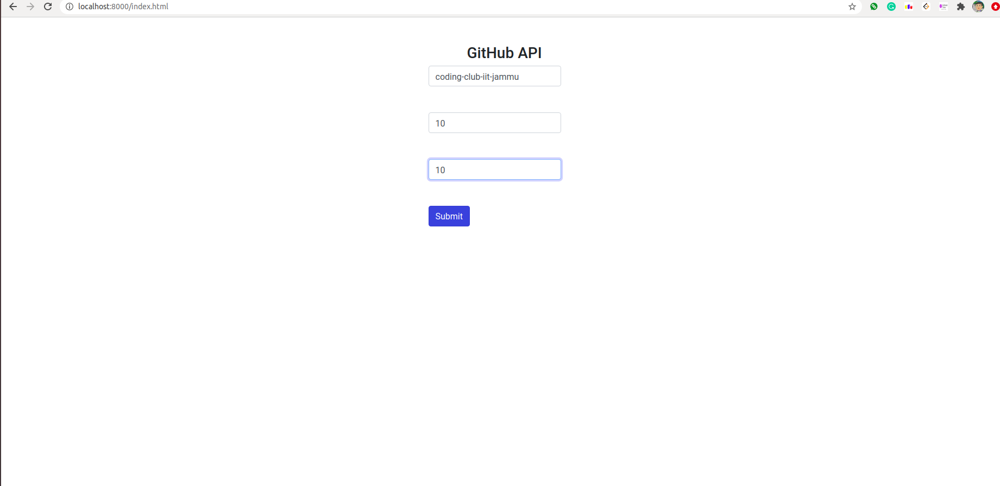
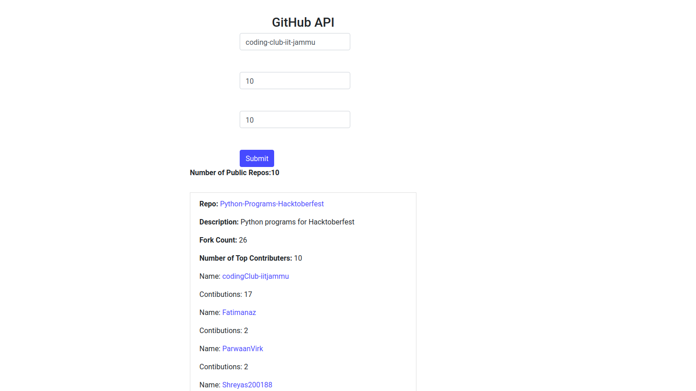
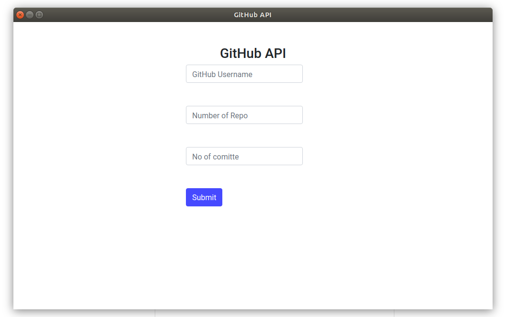
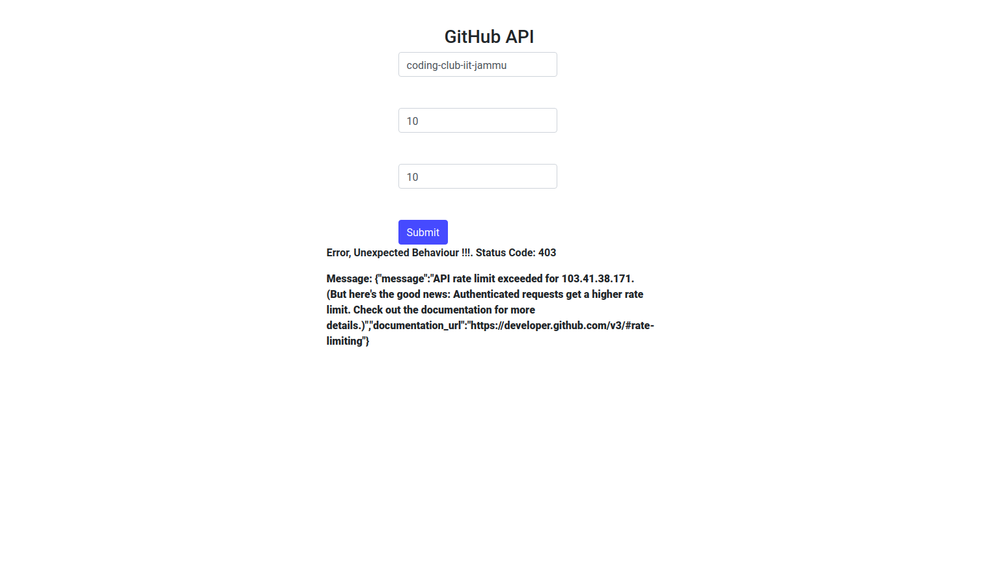
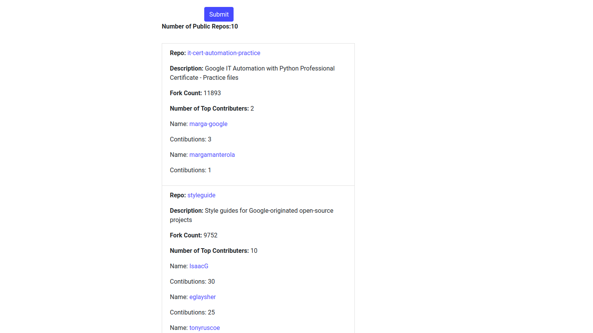
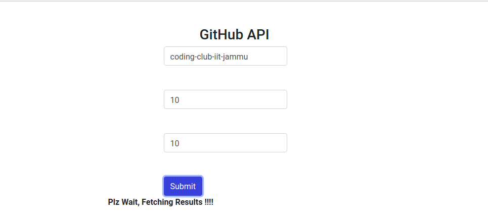

# GithubAPI_UI_Demo 
Finds the n most popular repositories of a given organization on Github (Eg:https://github.com/google) based on the number of forks. For each such repo finds the top m committees and their commit counts.









## Getting Started
- Clone the repo and cd into the directory
```sh
$ git clone https://github.com/rajatkhanna1999/GithubAPI_UI_Demo.git
$ cd PacketSniffer
```

- Install eel

```sh
$ pip install eel 
```

- Run the app

```sh
$ python3 GithubAPI.py
```

- Open the local host in browser
```sh
$ http://localhost:8000/index.html
```

## Packaging the app
You can pass any valid `pyinstaller` flag in the following command to further customize the way your app is built.
```sh
$ python -m eel GithubAPI.py web --noconsole --onefile --icon=packet-sniffer-tools.icns
```
