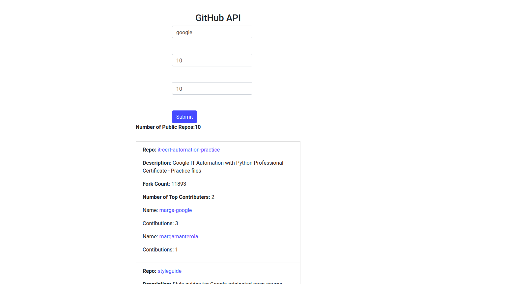

# GithubAPI_UI_Demo 
Finds the n most popular repositories of a given organization on Github (Eg:https://github.com/google) based on the number of forks. For each such repo finds the top m committees and their commit counts.





## Getting Started
- Clone the repo and cd into the directory
```sh
$ git clone https://github.com/rajatkhanna1999/GithubAPI_UI_Demo.git
$ cd GithubAPI_UI_Demo
```

- Install eel

```sh
$ pip install eel 
```

- Run the app

```sh
$ python3 GithubAPI.py
```

- Open the local host in browser
```sh
$ http://localhost:8000/index.html
```
